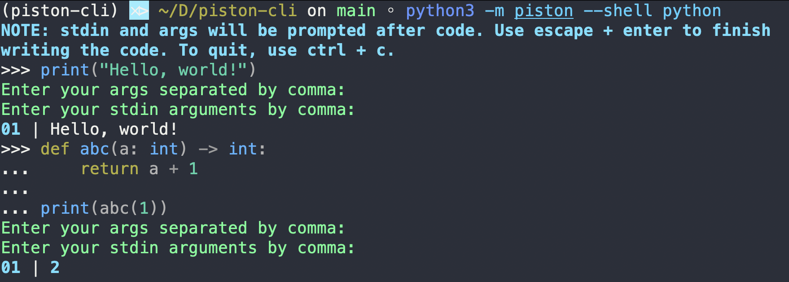
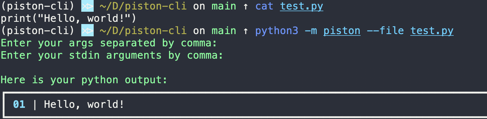
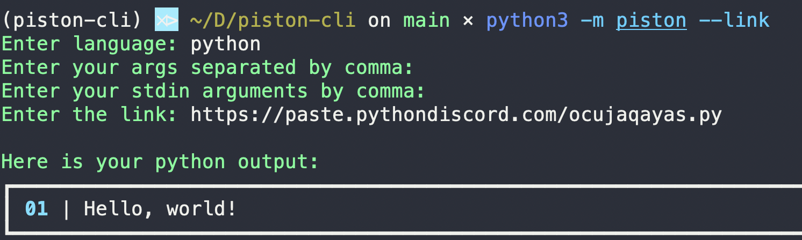

# Piston CLI

[]()
[]()
[]()
[]()
[]()
[]()

A cli tool which uses the [piston api](https://github.com/engineer-man/piston), developed by Engineerman and his team to compile over 35 languages instantly. Accepts files, paste.pythondiscord.com links and input.

### Installation

#### With pip

```bash
# Installing the package
pip3.8 install piston-cli -U
# Help Command
piston -h
```
#### With Nix/NixOS

Add this to your configuration.nix

```nix
  environment.systemPackages = with pkgs; [
     piston-cli
  ];
```

Or if you're using [home-manager](https://github.com/nix-community/home-manager)

```nix
  home.packages = with pkgs; [
     piston-cli
  ];
```

And finally using nix-env or nix profile

```bash
# using nix-env
nix-env -i piston-cli
# using nix profile (in nixUnstable)
nix profile install nixpkgs#piston-cli
```

### Example usage

#### Default


#### Shell



#### File



#### Link



### Languages

```bash
piston --list
```

## How to run it? (Contributing)

```shell
# This will install the development and project dependencies.
pipenv sync --dev

# This will install the pre-commit hooks.
pipenv run precommit

# Optionally: run pre-commit hooks to initialize them.
# You can start working on the feature after this.
pipenv run pre-commit run --all-files

# Run it
pipenv run start
```

## Contributing

You can comment on the issues you would like to work on.
