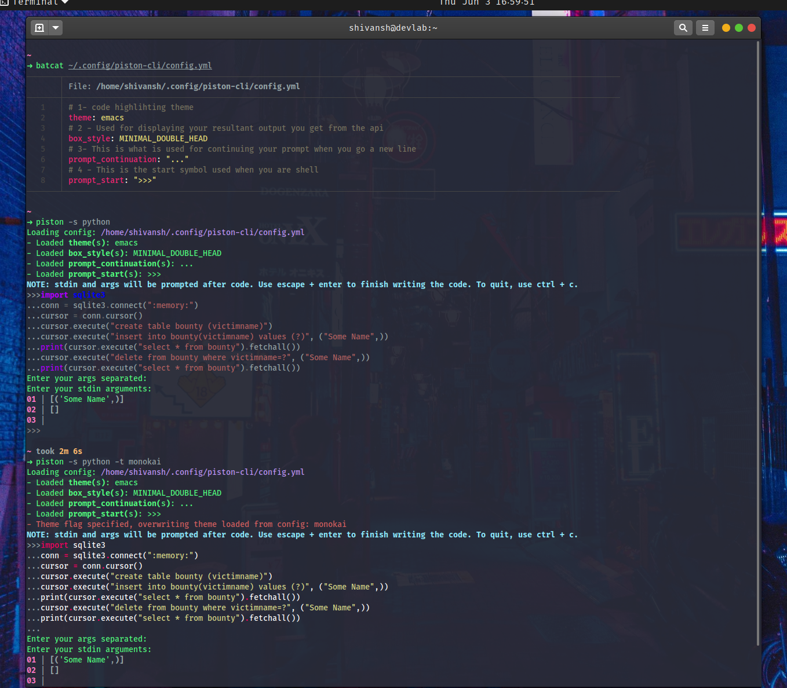
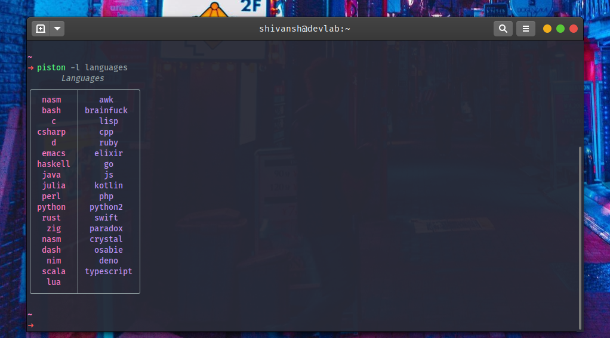

# Piston CLI

# Piston CLI

[](https://github.com/discord-modmail/modmail/actions/workflows/linting.yml "Lint")
[](https://www.python.org/downloads/ "Python 3.8 | 3.9")
[](./LICENSE "License file")
[](https://github.com/psf/black "The uncompromising python formatter")

A cli tool which uses the [piston api](https://github.com/engineer-man/piston), developed by Engineerman and his team to compile over 35 languages instantly. Accepts files, paste.pythondiscord.com links and input.
______________________________________________________________________

### Installation

#### With pip

<div class="termy">

```console
$ pip install piston-cli -U

---> 100%
```

</div>

#### With Nix/NixOS

`piston-cli` is available in [nixpkgs](https://github.com/nixos/nixpkgs) through the unstable channels.

You can install it with `nix-env`, or in a declarative way with configuration.nix or similar.

##### Flake support

`piston-cli` is a flake, that means you can easily add it to your flake based configuration:
Disclaimer: this also means you're using the development version, you could encounter bugs. If you want to use the stable version, install it from nixpkgs.

```nix
{
	inputs.nixpkgs.url = "github:nixos/nixpkgs/nixos-unstable";
	inputs.piston-cli.url = "github:piston-cli/piston-cli";

	outputs = { nixpkgs, piston-cli }:
	let
		pkgs = import nixpkgs { system = "x86_64-linux"; overlays = [ piston-cli.overlay ]; };
	in
	 {
		 # use pkgs.piston-cli-unstable here
	 };
}
```

#### For Arch/ArchBased

=== "With `yay`"

    <div class="termy">

    ```console
    $ yay piston-cli

    ---> 100%
    ```

    </div>

=== "With `paru`"

    <div class="termy">

    ```console
    $ paru piston-cli

    ---> 100%
    ```

    </div>

Or any AUR helper you use with doesn't matter. You get the point.

______________________________________________________________________

### Example usage

#### Default


#### Shell



#### File


#### Link


#### Languages



#### Themes


______________________________________________________________________

## How to run it? (Contributing)

Make sure you are in the project directory.

<div class="termy">

```console
$ poetry install

---> 100%
```

</div>

!!! tip
        Run `poetry run task precommit` to install precommit hooks.

        This runs our register pre-commit hooks on every commit to automatically point out issues in code such as missing semicolons, trailing whitespace, and debug statements. By pointing these issues out before code review, this allows a code reviewer to focus on the architecture of a change while not wasting time with trivial style nitpicks.

To run the project, use the (below) in the project root.

<div class="termy">

```console
$ poetry run task start

---> 100%
```

</div>
